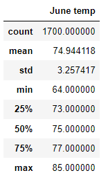
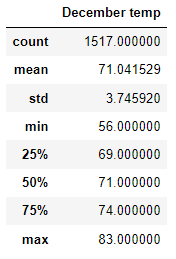

# surfs_up

## Overview
   &nbsp;&nbsp;&nbsp;&nbsp; In this module we will be utilizing SQLite with the intention of carrying out the same analytical work with SQL and databases but in a more compact manner. With SQLite we use less memory, no users, and more readily available for users on various platforms/devices. We will be carrying out an analysis of opening a surf shop in Hawaii however, we must break down weather data that may or may not impede the area therefore impede business and flow of customers/tourists. We will emphasize our data on two specifics months June and December.  
 ## Results:
     
      
  - In June we can see that we have more ideal conditions as both the count and standard deviation are higher than December inidcating the flow of clients is more ideal in June.
  - The minimum in June is at 64 and in December the minimum is at 56, clearly to cold to operate business as December draws closer in the season
  - Standard deviation is 3.25 in June and 3.75 -- making a .5 difference in the two different seasons 
## Summary
  &nbsp;&nbsp;&nbsp;&nbsp; Overall, it’s clear that its preferable to operate in the first half of the year as well as, a couple of months after. However, the business would take on losses if it tried to operate all year round. Its best if it operates for three quarters of the year since as we approach December the conditions become less ideal for the surf shop as well as, eating ice cream.
